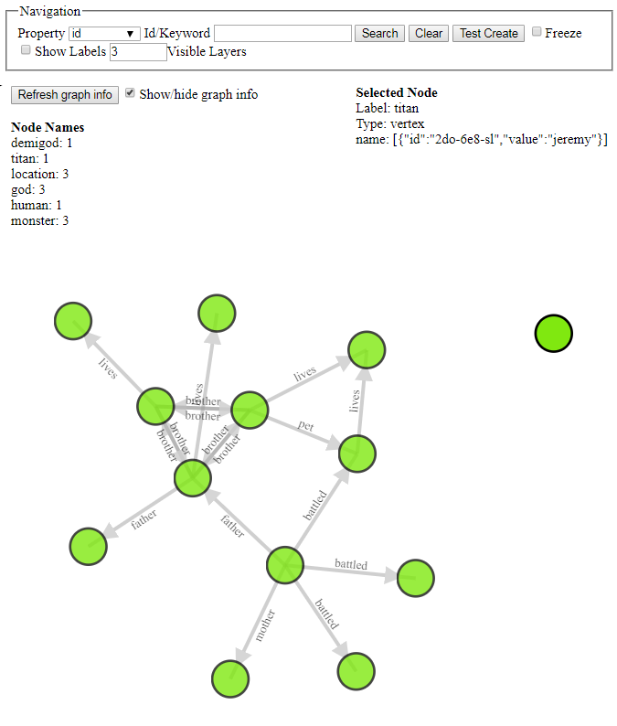
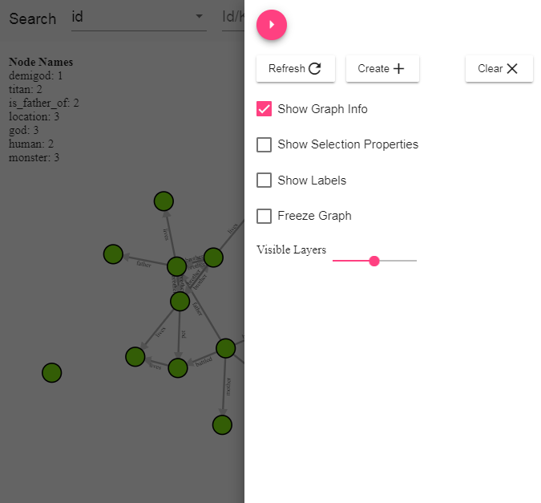
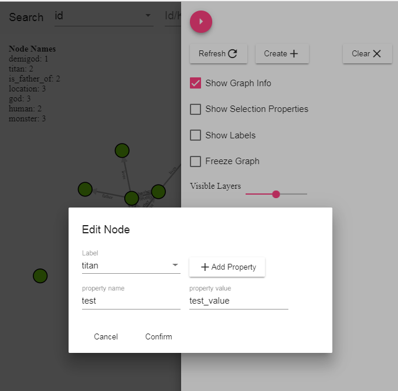
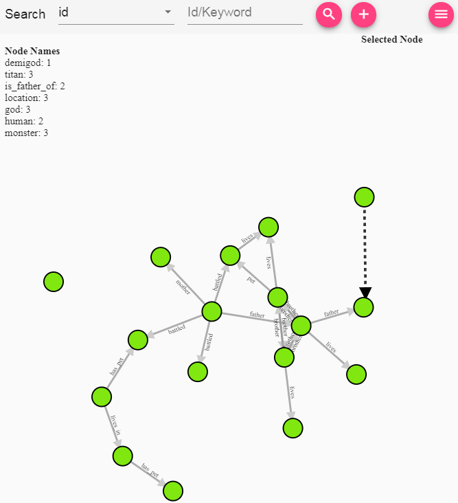
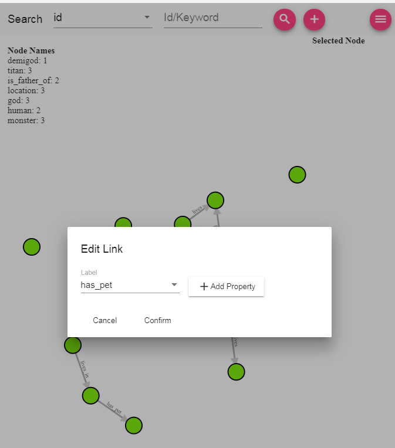

# ngx-graphexp
GraphExp plugin for Angular

## Installation  
yarn -  

    yarn add @savantly/ngx-graphexp

npm -  

    npm install @savantly/ngx-graphexp  

## Usage  
Import the required modules into your application  

    import { GraphexpModule, GraphexpService } from '@savantly/ngx-graphexp';
    import { GremlinClientOptions } from '@savantly/gremlin-js';  

Create an instance of the GraphexpService, passing in a configuration object -  

    export const graphexpService = new GraphexpService(new GremlinClientOptions());  
    
Use the component in your application, passing in custom options -  

    import { GraphConfig, GraphexpService } from '@savantly/ngx-graphexp';
	import { Component } from '@angular/core';
	
	@Component({
	  selector: 'sv-root',
	  template: '<sv-graphexp [graphexpService]="service" [graphConfig]="graphConfig"></sv-graphexp>',
	  styleUrls: ['./app.component.css']
	})
	export class AppComponent {
	
	  graphConfig: GraphConfig = new GraphConfig();
	
	  constructor (public service: GraphexpService) {
	    this.graphConfig.nodeLabels = ['god', 'titan', 'demigod', 'human', 'monster', 'location'];
	    this.graphConfig.linkLabels = ['is_father_of', 'has_pet', 'lives_in'];
	  }
	
	}

## Default GraphConfig options   

[graphConfig.ts](./src/app/modules/graphexp/graphViz/graphConfig.ts)  

## Default GremlinClientOptions  

[gremlin.client.options.ts](https://github.com/savantly-net/gremlin-js/blob/master/src/gremlin/gremlin.client.options.ts)  

## Screenshots 

  

  

Select a label and add properties to the node  
  

shift-drag to create a new connection between nodes  
  

Select the label and add properties to the link  
